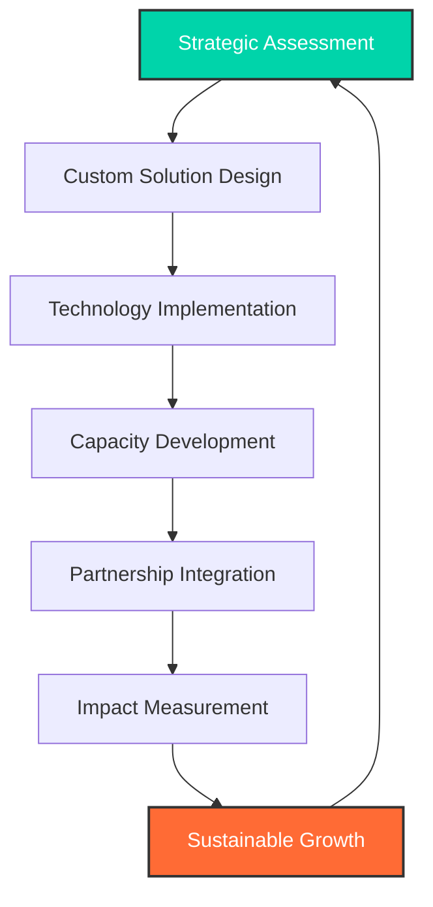

# 🌍 Avencion Limited

 

**🚀 Empowering Organizations • 🤝 Strategic Partnerships • 📊 Data-Driven Solutions • 🌱 Sustainable Growth**

---

## 🎯 **Impact at a Glance**

<table>
<tr>
<td align="center" width="25%">
 
<b>🤝 Trusted Clients</b>
</td>
<td align="center" width="25%">
 
<b>✅ Completed Projects</b>
</td>
<td align="center" width="25%">
 
<b>📅 Years of Excellence</b>
</td>
<td align="center" width="25%">
 
<b>🏢 Global Presence</b>
</td>
</tr>
</table>

---

## 🚀 **About Avencion**

Avencion Limited stands at the forefront of **African technological transformation**, partnering with governments, businesses, and communities to build sustainable, data-driven, and inclusive solutions. We specialize in bridging the gap between vision and implementation across multiple sectors.

<b>🎯 Our Mission & Vision</b>

 

> **Mission:** Deliver impactful solutions by prioritizing clients, leveraging human capacity, and fostering growth through sustainable partnerships.

> **Vision:** Empowering organizations for transformative growth through strategic partnerships and inclusive solutions.

---

## 🛠️ **Core Expertise**

### 💼 **Service Portfolio**

<table>
<tr>
<td width="50%" valign="top">

**🔬 Research & Analytics**
- Market Research & Analysis
- Data Management & Strategic Information
- Performance Management Systems

**🌐 Technology Solutions**
- ICT4D Implementation
- E-Government Platforms
- Digital Transformation

</td>
<td width="50%" valign="top">

**🤝 Strategic Partnerships**
- Public-Private Partnership (PPP)
- Stakeholder Management
- Coordination & Implementation

**👥 Human Resources**
- Recruitment & Payroll
- Organizational Development
- Psychometric Assessments

</td>
</tr>
</table>

---

## 🏆 **Featured Projects**

| 🏛️ **E-Government** | 🏥 **Health Analytics** | 👥 **HR Platform** |
|:---:|:---:|:---:|
|  |  |  |
| Scalable e-government platform for strategic information management | Advanced analytics dashboards supporting public health programs | Comprehensive recruitment and payroll processing solutions |

<b>🔍 View More Projects</b>

 

Our portfolio spans across various sectors including:
- **Health:** Digital health systems, epidemiological surveillance platforms
- **Energy:** Smart grid solutions, renewable energy project management
- **Agriculture:** Precision farming analytics, supply chain optimization
- **Education:** Learning management systems, capacity building platforms
- **Infrastructure:** Asset management systems, project tracking tools

---

## 🌟 **Our Impact Framework**

### 🎯 **Core Values**

| 🤝 **Strategic Partnerships** | 🌍 **Inclusive Solutions** | 👥 **Human Capacity** | 📊 **Data-Driven Decisions** | 🏆 **Quality Excellence** |
|:---:|:---:|:---:|:---:|:---:|
| Building lasting alliances | Creating accessible solutions | Empowering people | ICT4D implementation | Passion for results |

---

## 🌐 **Global Network**

<b>🤝 Notable Partners & Clients</b>

 

### 🎓 **Academic Partners**
Harvard University • Columbia University • Boston University • UCLA • MIT • University of San Francisco

### 🏛️ **Government & International**
PEPFAR • CDC • Smart Africa • ZBAN

### 💰 **Foundations & Development**
MasterCard Foundation • Gates Foundation

### 🏢 **Corporate Partners**
Black & Veatch • Copperbelt Energy Company • MTN • Airtel • Vodacom • Emirates Airlines

---

## 📍 **Global Presence**

### 🇿🇲 **Zambia Headquarters**
**📍** 2 Chifumbule Road, Woodlands, Lusaka, Zambia  
**📞** +260 960 638 188

### 🇺🇸 **USA Office**
**📍** 7557 Main Street Suite 601, Houston, TX 77030, USA  
**📞** +1 603 676 7171

---

## 🚀 **Join Our Mission**

### 💼 **Careers & Opportunities**

We're always seeking talented individuals who share our passion for transformative technology and sustainable development.

**⚡ Quick Response Promise:** We respond to all inquiries within 24 hours on business days!

---

## 🔗 **Connect With Us**

---

**© 2025 Avencion Limited — Transforming Africa Through Partnerships** 🌍✨

